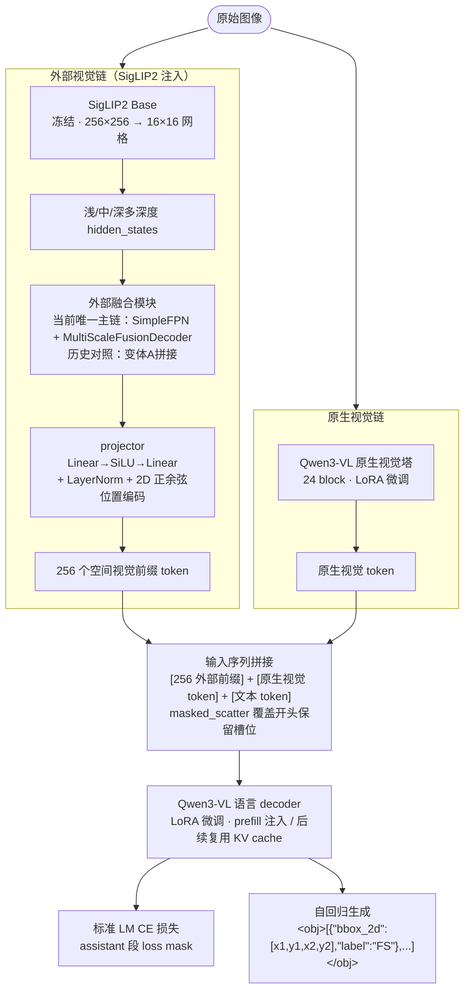
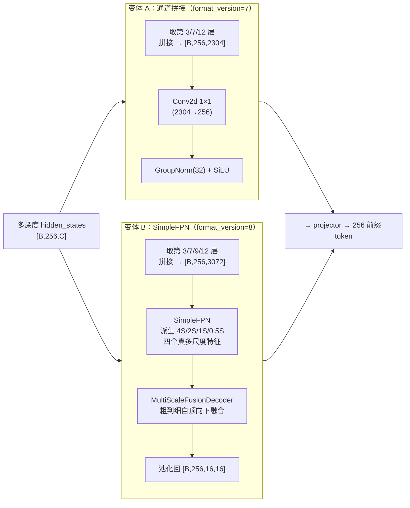
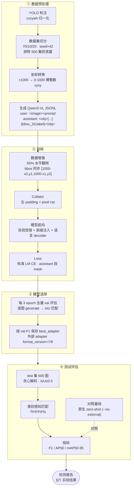

# 基于 Qwen3-VL 的管网缺陷生成式检测实验报告

> 评估基准：`数据_筛选3000`（train=2100 / val=300 / test=600），test IoU=0.5，类别感知匹配，贪心解码，无 NMS。当前唯一有效训练/部署基线为变体 B（SigLIP2 SimpleFPN，adapter `format_version=8`）；变体 A、ResNet 等仅保留作历史对照。

---

## 一、背景

城市地下管网（排水、污水等）的 CCTV 内窥检测是管网健康评估的核心手段。传统做法把"找到缺陷并定位"当成带检测头的视觉任务（YOLO/Faster-RCNN 等），需要为每个数据集单独训练回归头、且输出结构无法直接复用大模型的语义先验。

近年来多模态大模型（MLLM）在视觉理解上进步显著。Qwen3-VL 这类模型本身具备强大的图文对齐与指令遵循能力，能否把"目标检测"重新表述为**纯文本生成**——让模型自回归地吐出 `<obj>[{"bbox_2d":[x1,y1,x2,y2],"label":"FS"},...]</obj>` 这样的 JSON 文本——是一条值得验证的技术路线。这样检测就回归到因果语言建模（CAUSAL_LM），坐标作为数字 token、类别作为词表 token 一起参与 LM 损失，无需检测头。

但 Qwen3-VL 的原生视觉塔是端到端训练的通用编码器，对管内壁的细密纹理（腐蚀、裂纹、结垢）区分度有限，单凭其原生视觉特征在小样本下 Recall 偏低。为此本工作引入一条**外部冻结视觉特征注入链**：用语义分割预训练的 SigLIP2 Base 提取浅/中/深多深度特征，投影为空间视觉前缀 token，覆盖输入开头保留槽位，与 Qwen 原生视觉 token 一起送入语言解码器。

---

## 二、实验摘要

本工作在 Qwen3-VL-4B-Instruct 上构建了一条生成式管网缺陷检测链：自回归输出 `<obj>...</obj>` 包裹的 JSON 文本，bbox 用 0-1000 归一化裸整数，沿用基座原生词表，不引入检测头、不新增坐标 token。为弥补原生视觉塔对管内壁纹理的不足，额外注入冻结 SigLIP2 Base 的多深度特征作为空间视觉前缀，并通过 LoRA 微调语言 decoder 与原生视觉塔。

在 `数据_筛选3000`（12 类、test 600 图）上，微调后的检测链取得 **Test F1≈0.42–0.43、AP50≈0.19–0.20、mAP50-95≈0.09–0.10**，定位质量（matched IoU≈0.785）与格式稳定性（invalid bbox=0）均达标。作为对照，**未经任何微调的原始 Qwen3-VL**（zero-shot，仅靠 prompt 指令驱动）Test F1 仅 0.038、AP50=0.006，且 289 个预测为非法 bbox——说明在专业管网缺陷领域，仅靠大模型通用能力远不足以完成检测，LoRA 微调是必需环节。实验还考察了外部特征链的两种融合变体（通道拼接 / SimpleFPN 真多尺度融合），二者整体 F1 基本持平，说明在当前数据规模与分辨率下外部链融合结构不是瓶颈，主要制约在于候选目标发现与纹理类判别。

---

## 三、实验目的

1. **验证"检测即文本生成"路线**在管网缺陷小样本（2100 训练图、12 类）下的可行性，确认裸整数坐标 + 标准 LM CE 能否训出可用检测器。
2. **量化微调的必要性**：以未经任何微调的原始 Qwen3-VL（zero-shot）为下界对照，确认 LoRA 微调相对纯 prompt 驱动的增益。
3. **验证外部视觉特征注入**能否弥补 Qwen3-VL 原生视觉塔对管内壁纹理的不足，提升纹理类缺陷（FS 腐蚀、PL 材质破裂、JG 结垢）的 Recall。
4. **考察外部特征链的两种融合变体**（通道拼接 vs SimpleFPN 真多尺度融合），判断融合结构对检测性能的影响。

---

## 四、实验方法和技术路线

### 4.1 总体架构

整体是一个**双视觉链 + 单语言解码器**的生成式检测模型：



语言侧与 Qwen 原生视觉塔通过 LoRA 微调；SigLIP2 主干完全冻结，只训练外部融合模块与 projector。

### 4.2 坐标表示

采用 **0-1000 归一化裸整数** `[x1,y1,x2,y2]`（x 以原图宽、y 以原图高为基准），沿用 Qwen 基座原生词表的数字 token，不新增 location token、不 resize 词表。历史上曾试过 Falcon 风格 `<loc_0>..<loc_999>` location token，在小数据下训不动（epoch 1 即坐标失效），已弃用。推理反归一化 `bbox[i]/1000*W|H` 与训练前归一化严格互逆。

### 4.3 外部特征链（当前 v8 主链；v7 仅作历史对照）

冻结 SigLIP2 Base（原生 224 输入，运行时插值到 **256×256** → 16×16 patch 网格）提取多深度 hidden_states，经可训练融合模块压到 [B,256,16,16]。本工作实现并对比了两种融合结构：

- **变体 A（通道拼接，adapter format_version=7）**：取第 **3/7/12 层**（3 层）hidden_states 拼接为 [B,256,2304]，经 `Conv2d(2304→256,1×1)+GroupNorm(32)+SiLU`。这里的"多尺度"只是同一 16×16 空间网格上的多深度通道拼接，并非真空间多尺度。
- **变体 B（SimpleFPN 真多尺度融合，adapter format_version=8）**：取第 **3/7/9/12 层**（4 层）hidden_states 拼接为 [B,256,3072]，经 **SimpleFPN**（`SIMPLE_FPN_SCALE_FACTORS=(4,2,1,0.5)`）派生 4S/2S/1S/0.5S 四个真多尺度特征，再由**粗到细 MultiScaleFusionDecoder** 自顶向下融合并池化回 [B,256,16,16]。

两种变体的差异仅在外部融合模块；后续 projector、前缀注入、语言解码器、训练配置完全相同。变体 B 的设计意图是把同一网格的多深度特征转换为真空间多尺度，让浅层纹理（腐蚀、裂纹）与深层语义（障碍物、树根）在不同空间分辨率上互补。



变体 A 的"多尺度"是同一 16×16 网格上的通道堆叠；变体 B 才是真正的空间多尺度。两变体的系统对比见下表：

| 对比维度 | 变体 A（通道拼接） | 变体 B（SimpleFPN） |
|---|---|---|
| **取层** | 第 3/7/12 层（3 层） | 第 3/7/9/12 层（4 层，补第 9 层中深语义） |
| **输入特征** | 拼接 [B,256,2304] | 拼接 [B,256,3072] |
| **融合结构** | 单层 `Conv2d 1×1 + GroupNorm + SiLU` | SimpleFPN 4 分支 + MultiScaleFusionDecoder |
| **空间尺度** | 单一 16×16 网格（无空间多尺度） | 4S(64×64)/2S(32×32)/1S(16×16)/0.5S(8×8) 四尺度 |
| **融合机制** | 1×1 卷积跨通道线性组合 | 粗到细 U-Net 式：上采样 + 加法 skip + 卷积融合块 |
| **感受野** | 单点 1×1（纯逐像素） | 3×3 卷积 + 跨尺度上/下采样，覆盖邻域与多分辨率 |
| **外部融合参数量** | 0.59M | **55.33M**（约 94 倍） |
| **adapter 文件** | external_feature_adapter.pt ≈ 4 MB | ≈ 113 MB |
| **format_version** | 7 | 8 |
| **设计意图** | 轻量通道选择，浅/中/深特征线性组合 | 浅层纹理与深层语义在不同空间分辨率互补 |
| **Test F1** | 0.4268 | 0.4245（持平略降） |
| **行为特征** | 候选偏多（Pred 1167，FP 660） | 候选偏保守（Pred 944，FP 487，P↑R↓） |

**关键观察**：变体 B 用约 94 倍的参数量（0.59M→55.33M）构建了真正的空间多尺度融合，但并未换来 F1 提升（0.4268→0.4245）。这说明在当前 16×16 单网格分辨率与 2100 训练图规模下，外部特征的空间多尺度结构不是性能瓶颈——瓶颈在更上游的候选目标发现与纹理类判别，而非外部特征的表达能力。变体 B 的主要效果是改变了候选策略（更保守、Precision 更高），而非提升整体检测能力。

### 4.4 前缀注入

外部特征展平为 256 个 token，经 projector（`Linear(256→512)→SiLU→Linear(512→hidden)` + LayerNorm + 二维正余弦位置编码）对齐到 hidden_size，覆盖输入序列开头 256 个保留槽位（`masked_scatter`），随后与 Qwen 原生视觉 token 一起进入语言解码器。仅 prefill 阶段注入，后续生成 token 复用 KV cache。

### 4.5 训练配置

- **LoRA**：r=32, alpha=64, dropout=0.05；目标模块覆盖语言 decoder 的 `q/k/v/o/gate/up/down_proj` 与 Qwen 原生视觉塔全部 24 个 block 的 `attn.qkv/attn.proj/mlp.linear_fc1/fc2`；norm 全量微调关闭（消融已证明有害）。
- **优化器**：所有参数组统一 lr=1e-4，constant 调度，warmup=0，weight_decay=0.01，`paged_adamw_8bit`，梯度裁剪 1.0。
- **batch**：per_device=2 × accum=4（有效 8），bf16，gradient_checkpointing。
- **epoch**：30，关闭 F1 早停跑满全程，每 3 epoch 全量验证、按 val F1 选 best。
- **损失**：仅标准 LM CE（assistant 段 loss mask，其前置 -100）。
- **数据增强**：训练集 50% 概率水平翻转，bbox 同步 `[x1,y1,x2,y2] → [1000-x2,y1,1000-x1,y2]`，翻转后 PIL 替换 record["image"] 保证两视觉链同图。val/test 不增强。

### 4.6 评估流程

- **IoU 匹配**（`match_image`）：类别感知贪心匹配，IoU≥0.5 记 TP，同框异类记 FP，未匹配 GT 记 FN。
- **生成参数**：贪心解码（do_sample=False，可复现），max_new_tokens=512。
- **AP50/mAP50-95**：COCO 风格 precision-envelope，mAP50-95 为 IoU 0.5–0.95 步长 0.05 平均。
- **三端一致性**：训练/推理共用同一 processor 参数（min/max_pixels），词表保持基座原生，外部 adapter 必须 `load_external_adapter(strict=True)` 加载，缺失/版本不匹配直接报错。
- **原生 zero-shot 基线**：评估时用 `--no-external`（禁用 SigLIP2 前缀注入）且不加载任何 LoRA adapter，即完全原始的 Qwen3-VL-4B-Instruct 仅靠推理 prompt 驱动，用于量化微调的必要性与增益下界。

### 4.7 端到端技术路线

下图给出从原始 YOLO 数据到最终 test 评估的完整流程，对应报告第五、六章的数据流：



该路线图与 AGENTS.md「三端一致性铁律」对应：训练/推理共用同一 processor、同一原生词表、外部 adapter 严格加载，任一环节不一致都会导致分布漂移与检测失效。

---

## 五、实验材料与数据

### 5.1 数据集

**管网缺陷 数据_筛选3000**（YOLO 格式，12 类）。按 70/10/20 随机切分（seed=42），并预先排除 `数据_筛选500` 的 test/val 样本以防数据泄露：

| 划分 | 图像数 | 用途 |
|---|---:|---|
| train | 2100 | 训练（含水平翻转增强） |
| val | 300 | best 模型选择 |
| test | 600 | 最终评估 |

### 5.2 数据预处理流程

**YOLO → Qwen3-VL JSONL 转换**（`scripts/convert_yolo_to_qwenvl.py`）：

YOLO 标注为 cxcywh 归一化格式。由于 YOLO 已按轴向归一化、与 Qwen 的 0-1000 相对坐标同维，转换**无需读原图尺寸**，直接：

```
x1 = round((xc - w/2) * 1000)
y1 = round((yc - h/2) * 1000)
x2 = round((xc + w/2) * 1000)
y2 = round((yc + h/2) * 1000)
# clip 到 [0,1000]；退化框（x2<=x1 或 y2<=y1）丢弃
```

输出 JSONL 每条记录结构：

```json
{"id": "<图像 stem>",
 "image": "<图像绝对路径>",
 "conversations": [
   {"from": "user", "value": "<image>\n<12 类缺陷清单英文 prompt>"},
   {"from": "assistant", "value": "<obj>[{\"bbox_2d\":[x1,y1,x2,y2],\"label\":\"FS\"},...]</obj>"}
 ]}
```

bbox 在 `<obj>...</obj>` 内为 0-1000 裸整数，label 用 12 类代码（AJ/BX/CJ/CK/CR/FS/JG/PL/SG/TJ/TL/ZW）。训练用英文 prompt 来自 `data/pipe_defect_3000_prompt_train_en.json`。

### 5.3 12 类缺陷代码

| 代码 | 含义 | 代码 | 含义 |
|---|---|---|---|
| AJ | 支管暗接 | PL | 材质破裂 |
| BX | 截面变形 | SG | 树根侵入 |
| CJ | 淤积 | TJ | 接口脱节 |
| CK | 错口 | TL | 接口材料脱落 |
| CR | 管壁穿透 | ZW | 异物障碍 |
| FS | 腐蚀 | | |
| JG | 结垢 | | |

### 5.4 模型与算力

- **基座**：Qwen3-VL-4B-Instruct
- **外部视觉主干**：SigLIP2 Base patch16-224（冻结，运行时插值到 256×256）
- **训练框架**：transformers 4.57.6 / peft 0.18.1，自定义 Dataset+Collator+原生 Trainer
- **算力**：单机 bf16，gradient_checkpointing 显存优化

---

## 六、实验结果

### 6.1 全局指标：三种配置对照

下表把三种配置的 test 全局指标并列，用于界定性能上下界：

| 指标 | 原生 Qwen3-VL（zero-shot） | 变体 A（拼接，微调） | 变体 B（SimpleFPN，微调） |
|---|---:|---:|---:|
| Pred | 319 | 1167 | 944 |
| TP | 29 | 507 | 457 |
| FP | 290 | 660 | 487 |
| FN | 1180 | 702 | 752 |
| Precision | 0.0909 | 0.4344 | 0.4841 |
| Recall | 0.0240 | 0.4194 | 0.3780 |
| **F1** | **0.0380** | **0.4268** | **0.4245** |
| AP50 | 0.0059 | 0.2041 | 0.1931 |
| mAP50-95 | 0.0023 | 0.0987 | 0.0926 |
| Mean matched IoU | 0.6771 | 0.7854 | 0.7847 |
| Invalid bbox | 289 | 0 | 0 |

原生 Qwen3-VL 几乎完全失效：1209 个 GT 仅命中 29 个（Recall 2.4%），且 289 个预测为非法 bbox（坐标越界或格式错误），AP50 接近 0。经 LoRA 微调后 F1 提升约 **11 倍**（0.038→0.43），非法 bbox 清零，定位质量也明显改善（matched IoU 0.677→0.785）。这证明在专业管网缺陷领域，仅靠大模型通用先验与 prompt 指令远不足以完成检测，**LoRA 微调是必需环节**。

### 6.2 训练动态（验证集 F1 曲线）

**变体 A（通道拼接）**，best epoch=30，val F1=0.4722：

| Epoch | 3 | 6 | 9 | 12 | 15 | 18 | 21 | 24 | 27 | 30 |
|---|---:|---:|---:|---:|---:|---:|---:|---:|---:|---:|
| F1 | 0.347 | 0.421 | 0.432 | 0.425 | 0.455 | 0.454 | 0.424 | 0.396 | 0.446 | **0.4722** |

| Epoch | 3 | 6 | 9 | 12 | 15 | 18 | 21 | 24 | 27 | 30 |
|---|---:|---:|---:|---:|---:|---:|---:|---:|---:|---:|
| F1 | 0.347 | 0.421 | 0.432 | 0.425 | 0.455 | 0.454 | 0.424 | 0.396 | 0.446 | **0.4722** |

**变体 B（SimpleFPN）**，best epoch=15，val F1=0.4581：

| Epoch | 3 | 6 | 9 | 12 | 15 | 18 | 21 | 24 | 27 |
|---|---:|---:|---:|---:|---:|---:|---:|---:|---:|
| F1 | 0.361 | 0.401 | 0.418 | 0.388 | **0.4581** | 0.427 | 0.430 | 0.427 | 0.447 |

两条曲线波动都明显，说明仅凭中途单次验证触发早停可能错过后期更优点。

### 6.3 微调两变体的行为差异

§6.1 已给出三种配置的全局指标。这里聚焦两个微调变体的行为差异：变体 A（通道拼接）与变体 B（SimpleFPN）整体 F1 基本持平（0.4268 vs 0.4245），定位质量与格式稳定性一致（matched IoU≈0.785、invalid=0）。差异体现在候选策略上：变体 B 预测总数更少（944 vs 1167）、FP 更少（487 vs 660），但 TP 也略降、FN 升高，表现为 Precision 更高（0.484 vs 0.434）、Recall 更低（0.378 vs 0.419）——即 SimpleFPN 使候选发现更保守（少报但更准）。两种融合结构都未显著拉开差距，说明在当前数据规模与 16×16 分辨率下外部链融合结构不是性能瓶颈。

### 6.4 各类别 test 指标

| 类别 | GT | 变体A P | 变体A R | 变体A F1 | 变体A AP50 | 变体B P | 变体B R | 变体B F1 | 变体B AP50 |
|---|---:|---:|---:|---:|---:|---:|---:|---:|---:|
| AJ | 37 | 0.3095 | 0.3514 | 0.3291 | 0.1626 | 0.3750 | 0.2432 | 0.2951 | 0.1104 |
| BX | 78 | 0.4405 | 0.4744 | 0.4568 | 0.2294 | 0.4247 | 0.3974 | 0.4106 | 0.1791 |
| CJ | 83 | 0.6087 | 0.5060 | 0.5526 | 0.4171 | 0.6032 | 0.4578 | 0.5205 | 0.3970 |
| CK | 104 | 0.3465 | 0.3365 | 0.3415 | 0.1431 | 0.6364 | 0.3365 | 0.4403 | 0.2271 |
| CR | 90 | 0.3956 | 0.4000 | 0.3978 | 0.1628 | 0.4559 | 0.3444 | 0.3924 | 0.1692 |
| FS | 117 | 0.3457 | 0.2393 | 0.2828 | 0.0859 | 0.2817 | 0.1709 | 0.2128 | 0.0564 |
| JG | 118 | 0.4700 | 0.3983 | 0.4312 | 0.2108 | 0.6111 | 0.3729 | 0.4632 | 0.2418 |
| PL | 109 | 0.3519 | 0.3486 | 0.3502 | 0.1607 | 0.3908 | 0.3119 | 0.3469 | 0.1331 |
| SG | 140 | 0.4837 | 0.5286 | 0.5051 | 0.3318 | 0.5620 | 0.5500 | 0.5560 | 0.3868 |
| TJ | 107 | 0.5169 | 0.5701 | 0.5422 | 0.2975 | 0.5275 | 0.4486 | 0.4848 | 0.2366 |
| TL | 46 | 0.5200 | 0.2826 | 0.3662 | 0.1906 | 0.5000 | 0.2174 | 0.3030 | 0.1583 |
| ZW | 180 | 0.4256 | 0.4611 | 0.4427 | 0.2040 | 0.4372 | 0.4444 | 0.4408 | 0.1972 |

两种变体共同的薄弱类一致：**FS（腐蚀）** Recall 最低（0.17–0.24），**TL（接口材料脱落）** 因样本最少（46）Recall 持续偏低。表现较好的是 SG（树根侵入）、TJ（接口脱节）、CJ（淤积）。

### 6.5 混淆分析

两种变体的主导错误模式相同，都不是"类间混淆"，而是**漏检（GT→background）**与**背景误判（background→某类）**。以变体 B 为例：

- 漏检最严重：FS→background 87、ZW→background 85、PL→background 69、JG→background 58、CK→background 57
- 背景误判最严重：background→ZW 69、background→SG 53、background→PL 43

真正的类间混淆计数普遍很低（≤13），说明模型的主要难点是"该不该报"（候选发现与背景判别），而非"报成哪一类"（类别判别）。

---

## 七、可视化结果

> 图示约定：**绿框 = GT（标注），红框 = Pred（预测）**，每张图同时叠加显示。
> 以下取自变体 B（SimpleFPN，当前基线）的 test 评估输出。

### 7.1 混淆矩阵

**微调后（变体 B，SimpleFPN）**：


对角线为各类 TP，最末行列为 background 漏检/误检。错误集中在 GT→background（漏检）和 background→ZW/SG（背景误判为障碍/树根）。

**作为对照，未经微调的原始 Qwen3-VL（zero-shot）混淆矩阵**：


可见对角线几乎全为 0（多数类 TP=0），GT 几乎全部落到 background 列（漏检），而 background 行又向 PL/ZW/SG 散布（幻觉误判）。这与 §6.1 的全局指标一致：原生模型在专业缺陷类上基本不具备定位能力，反衬出微调的必要性。

### 7.2 检测良好的样本

**X0307**（GT=5, Pred=5, TP=4, FP=1, FN=1）：多目标场景下多数缺陷被正确检出。


**888250893e035cc34fd54a4f52273a01**（GT=3, Pred=3, TP=3, FP=0, FN=0）：完美检测。


### 7.3 漏检严重的样本

**xncd1003-2586**（GT=10, Pred=2, TP=1, FP=1, FN=9）：密集缺陷大量漏检。


**xncd1003-2289**（GT=9, Pred=1, TP=0, FP=1, FN=9）：几乎全部漏检。


### 7.4 误检严重的样本

**xncd1003-2676**（GT=2, Pred=5, TP=0, FP=5, FN=2）：背景被误判为缺陷。


**hxh-0846**（GT=6, Pred=4, TP=0, FP=4, FN=6）：误检与漏检并存。


---

## 八、结论

1. **"检测即文本生成"路线可行**：裸整数坐标 + 标准 LM CE 在 2100 训练图上能训出可用检测器，定位质量（matched IoU≈0.785）与格式稳定性（invalid=0）均达标。
2. **微调是必需环节**：未经微调的原始 Qwen3-VL（zero-shot）Test F1 仅 0.038、AP50=0.006，1209 个 GT 仅命中 29 个，且产生 289 个非法 bbox；LoRA 微调后 F1 提升约 11 倍、非法 bbox 清零。在专业管网缺陷领域，仅靠大模型通用先验与 prompt 指令远不足以完成检测。
3. **外部特征注入对纹理类 Recall 改善有限**：无论拼接式还是 SimpleFPN，FS（腐蚀）的 Recall 都最低（0.17–0.24），TL（接口材料脱落）因样本少也持续偏低。
4. **外部链融合结构不是当前瓶颈**：通道拼接与 SimpleFPN 真多尺度融合整体 F1 持平（0.4268 vs 0.4245），SimpleFPN 使模型更保守（Precision↑、Recall↓），但未带来整体收益。
5. **主要瓶颈是候选发现与背景判别**：错误以漏检（GT→background）和背景误判（background→缺陷）为主，类间混淆很少，定位与格式已不是问题。
6. **后续方向**：外部链转向输入分辨率提升（256→384，隔离分辨率收益）与类别均衡/困难样本采样（针对 FS/TL 低 Recall）；保持裸整数坐标链与现有训练配置不变。
